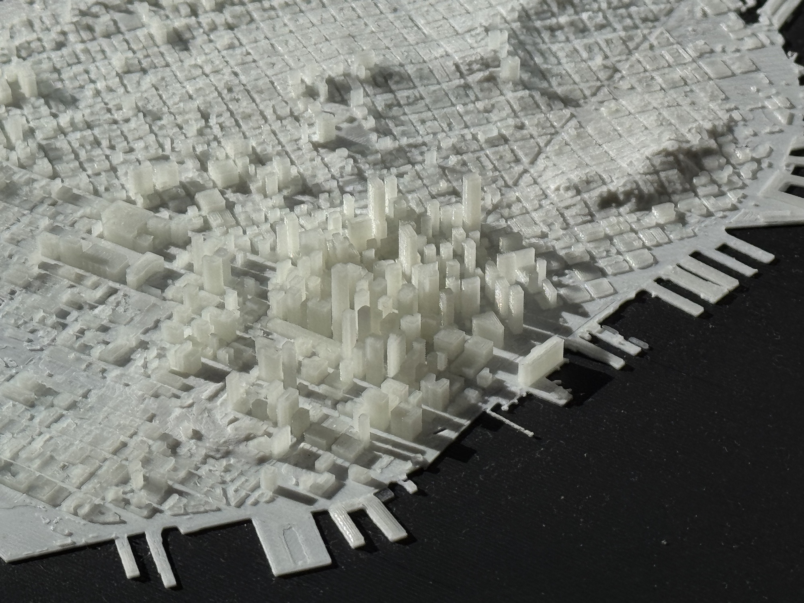
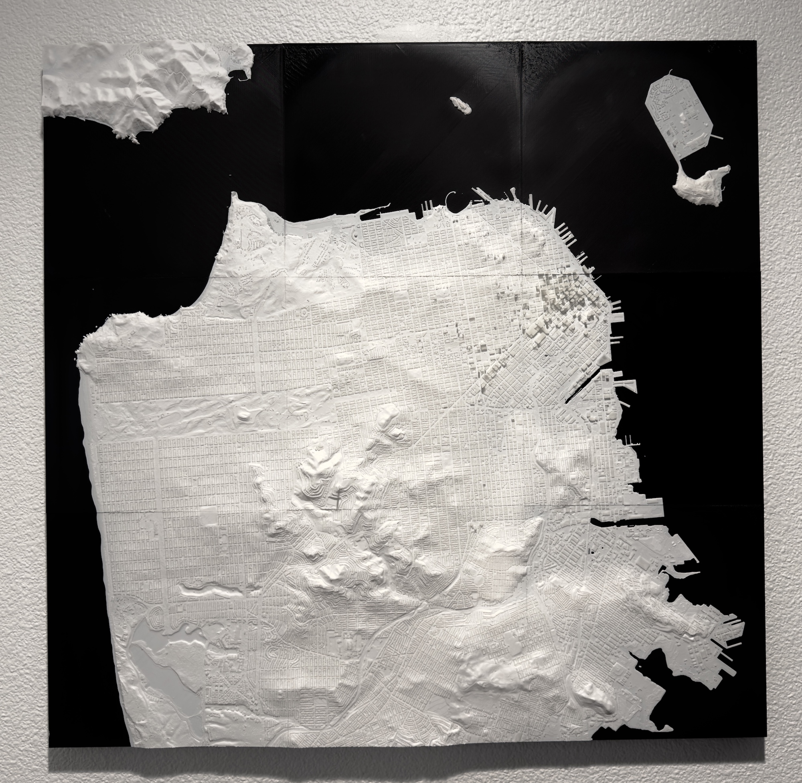
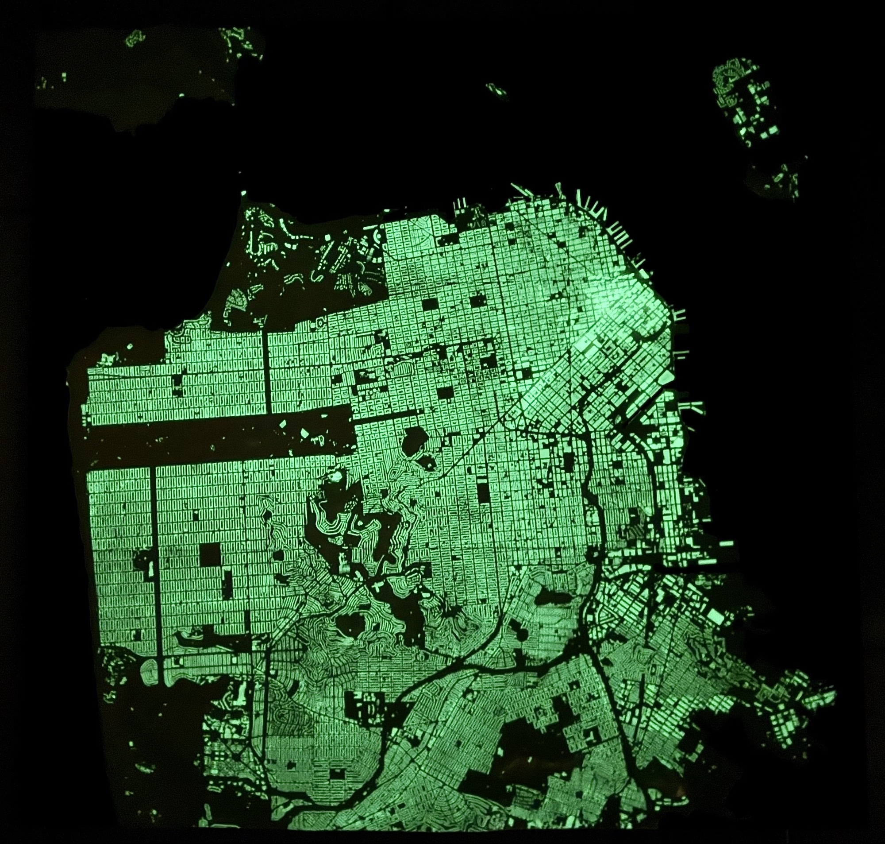
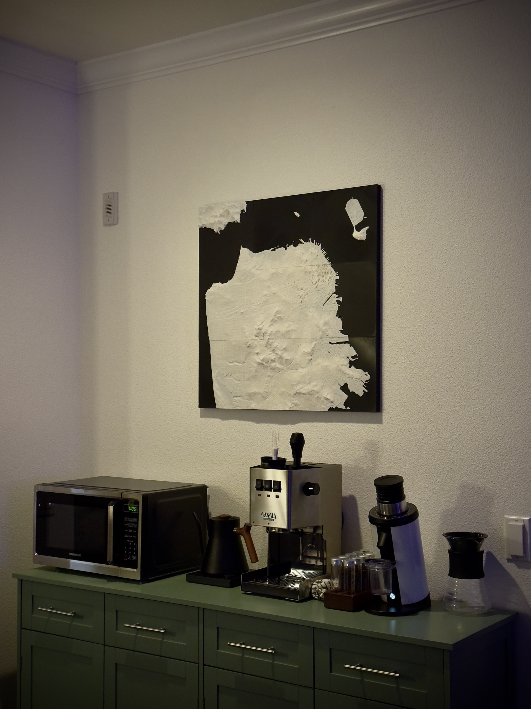
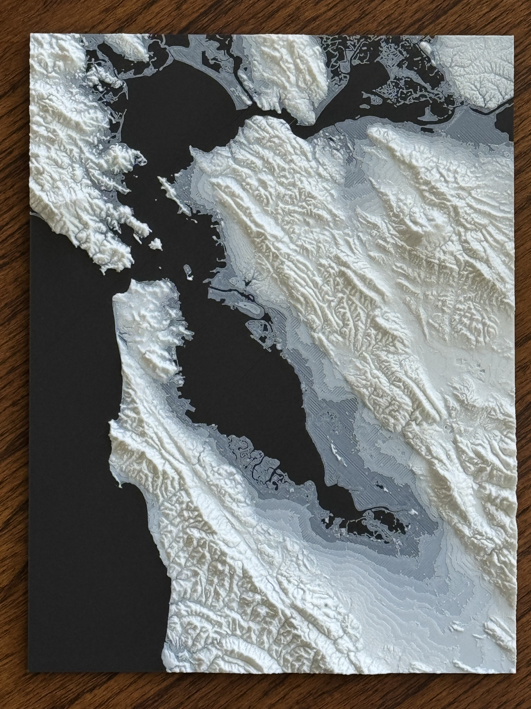

# Topo-Tessellate

Generate 3D-printable terrain models from real-world elevation and building data.

- **Terrain**: Create meshes from SRTM or high-resolution GeoTIFF elevation data
- **Buildings**: Extract 3D building footprints from OpenStreetMap
- **Tiling**: Split large regions into interlocking tiles for printing
- **Adaptive Meshing**: Intelligent simplification/building merging for very large regions

<table>
  <tr>
    <td></td>
    <td></td>
  </tr>
  <tr>
    <td></td>
    <td></td>
  </tr>
</table>

## [Get Started](docs/get_started.md)

## License

GPL-3.0 - See [LICENSE](LICENSE) for details.

## Acknowledgments

- Elevation data provided by [USGS National Map](https://apps.nationalmap.gov/downloader/)
- Building data from [OpenStreetMap](https://www.openstreetmap.org/) contributors
- [MeshLib](https://github.com/MeshInspector/MeshLib) for mesh processing
- [Rasterio](https://rasterio.readthedocs.io/) for geospatial raster I/O
