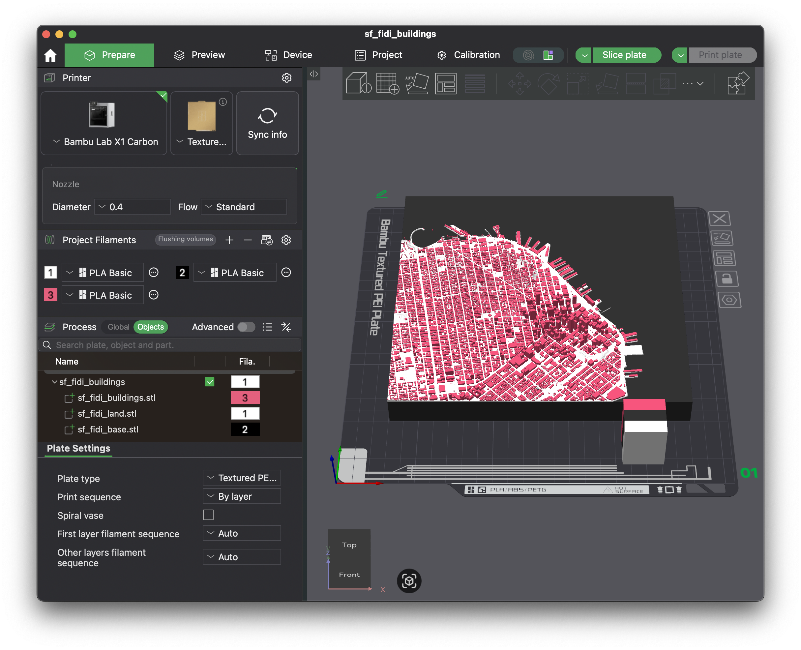
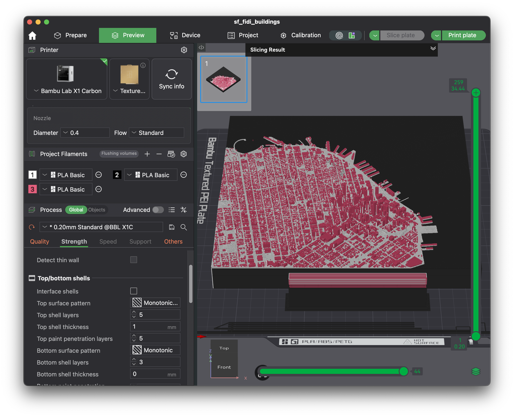

# 3D Printing

Now that you've generated the base, land, and buildings models for your area of choice, it's time to 3D print them!

## Printing the tessellation

### Slicing

In the `outputs` folder, you'll see STL files for the `base`, `land`, and `buildings` for each tile.

1. In your slicer, open all three files at once. If prompted to "load these files as a single object with multiple parts", click `Yes`.

2. Then, select individual colors for the three models if your printer supports multiple materials. The result should look like the screenshot above.

3. Change the following slicer settings for better results:
   1. Choose the smallest layer height your 3D printer supports for the best results. Otherwise, you'll see banding on flatter areas of the model. Or, if your slicer supports it, set the layer height of the base to be higher than the land/buildings using the adaptive layer height tool or a height range modifier.
   2. If you need more space, set the prime tower's width to be much longer than the default and disable "Rib Wall"
   3. Set the Wall Generator from "Classic" to "Arachne". The latter performs much better at printing features thinner than the nozzle, such as small buildings/terrain features. For best results, set the "Minimum Wall Width" to 50%.
   4. If you have space, enable brim ears in the corners to prevent warping.
   5. For larger tessellations, increase the wall count to improve strength.

4. When ready, click the "Slice" button! Note that slicing may take a long time, since these models can get quite large/intricate.

### Printing

Here are few tips for the cleanest results when printing:

1. These models are very large and thus prone to warping. If the part warps, the nozzle will drag across the top surface of the print, ruining the finish. To avoid warping:
   1. Use new, DRY filament. If you do not have a filament dryer, I'd consider it a good investment. Additionally, add desiccant packets to your filament storage. I found that results tend to worsen as soon as relative humidity rose above 10%.
   2. Use a strong glue to bond the print to the build plate, such as the [VisionMiner Nano Polymer Adhesive](https://visionminer.com/products/nano-polymer-adhesive). After a wipe with isopropyl alcohol, re-apply the adhesive every 2-3 prints for the best results.
   3. Ensure that your build plate is as level as possible.
   4. Close any nearby windows/avoid drafts.
2. I achieved the most aesthetic results with matte PLA.
3. Glow-in-the-dark PLA for the buildings is a nice touch; however, note that the glow effect is extremely weak.
4. For the smoothest top-layer on the base, I recommend fine-tuning your ironing settings first.