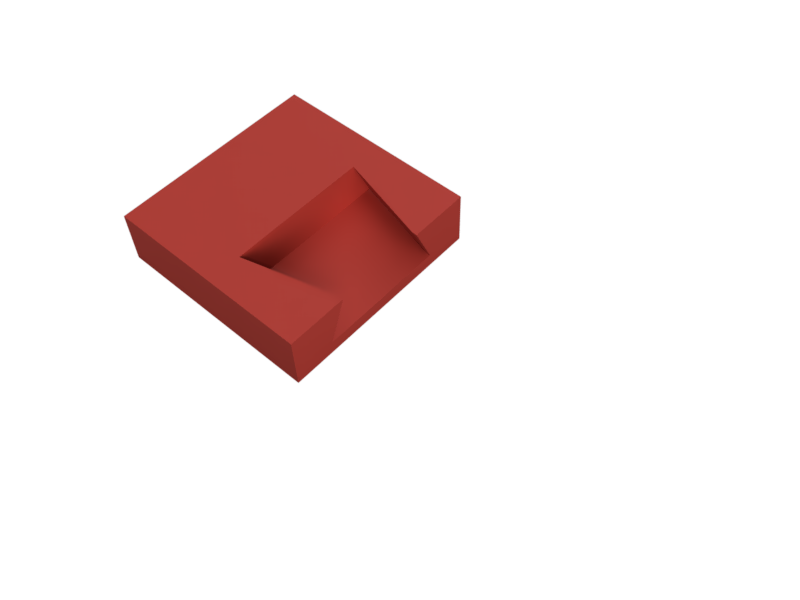
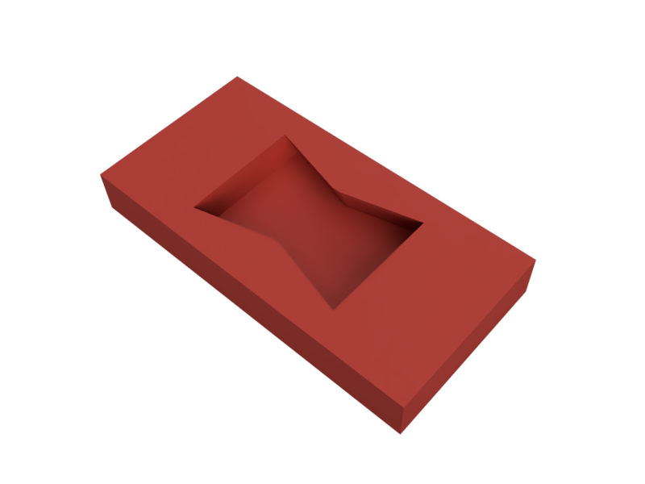
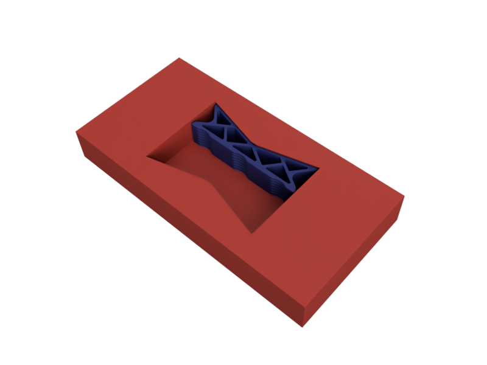
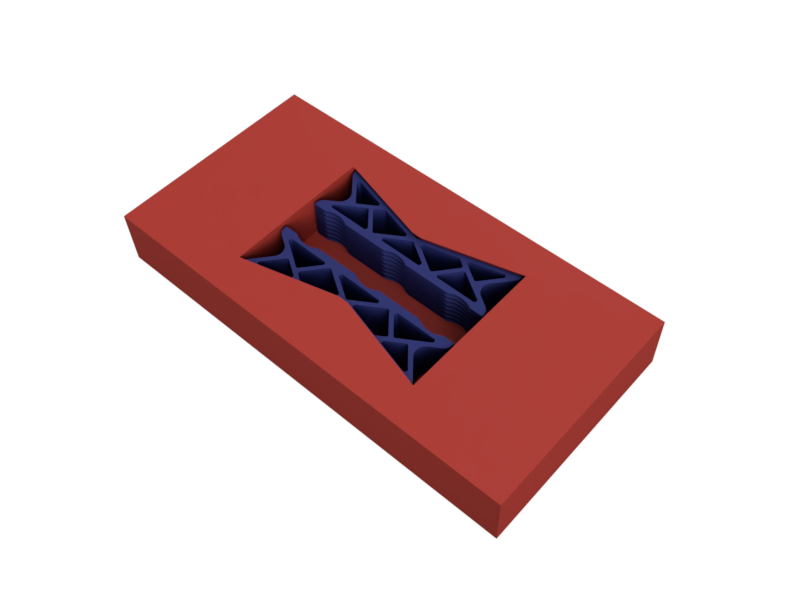
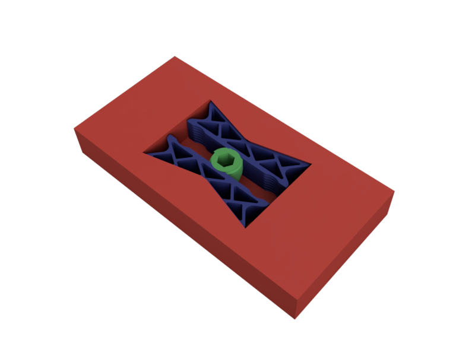
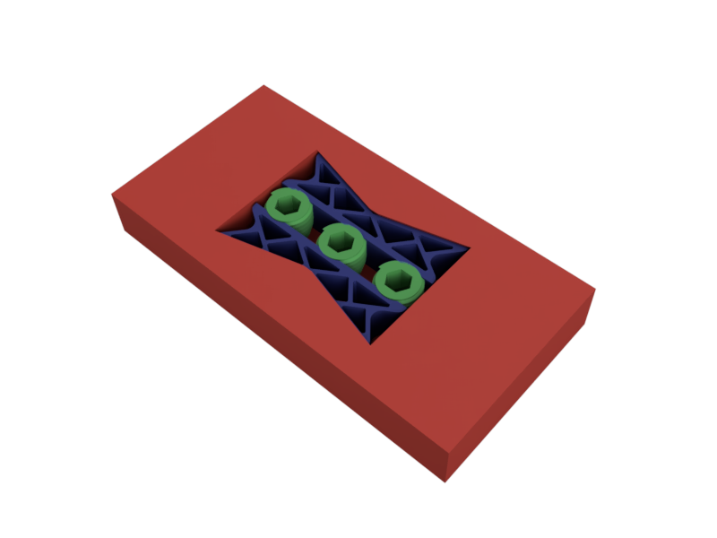

# Assembly

Now that everything is printed, it's time to assemble the tessellation!

## Preparation

1. Sand the mating edges to remove any lips/gaps. Use a medium-grit sandpaper (~400 grit is fine) on a sanding block and sand gently in a back and forth motion. Be extra careful to sand evenly so that the edges are still flat and perpendicular.
2. Clean the edges with water to remove any excess sanding dust.

## Assembly

1. Start with one of the tiles. It's helpful to do this near the edge of a table so that you have access to the underside of the model.

2. Place the second tile next to the first tile. Inspect the edge for any visible gaps. If there are any gaps, sand the edges again until they are flush.

3. Slide the left joint into the dovetail cutout.

4. Slide the right joint into the dovetail cutout.

5. Screw in one of the joint screws into the center position to lock the two tiles together.

6. Screw in the other joint screws into the outer positions to lock the two tiles together.

7. Repeat for all tiles in the tessellation.
